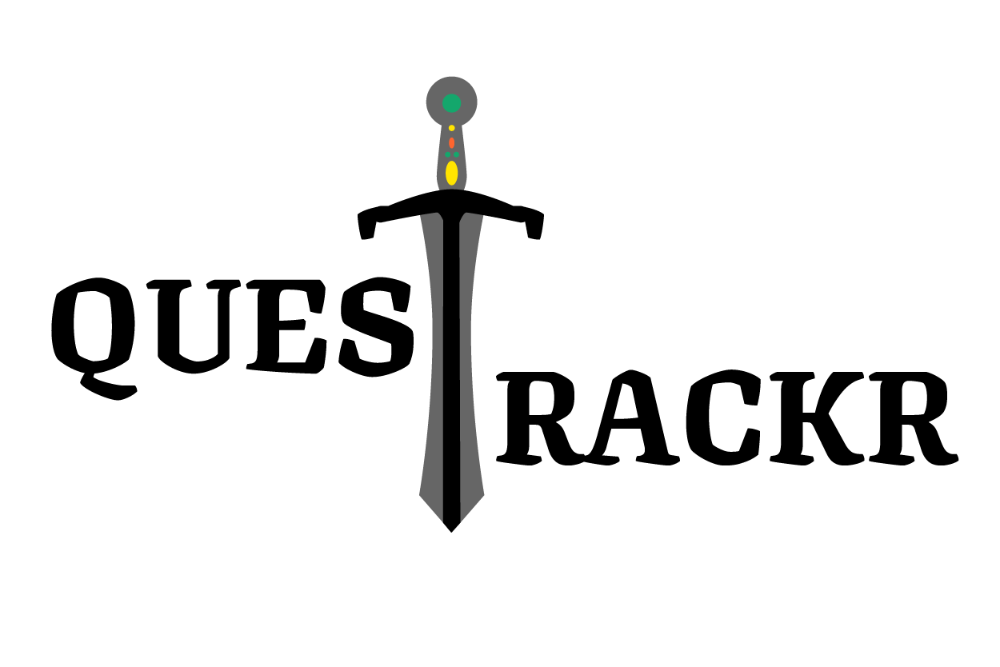

# QuestTrackr

<p align="center">
    
</p>

[](https://www.github.com/Lazytangent/QuestTrackr/contributors)
[](https://www.github.com/Lazytangent/QuestTrackr/issues)
[](https://www.github.com/Lazytangent/QuestTrackr/forks)
[](https://www.github.com/Lazytangent/QuestTrackr/stars)

## What is it?

[QuestTrackr](https://quest-trackr.herokuapp.com/) is a clone of the popular web app [Remember the Milk](https://www.rememberthemilk.com/) with an RPG twist.

## Developing

To run this application locally, you'll need to:

1. `git clone` this repo
2. `cd` into the local repo
3. `npm install` to install the dependencies
4. Create a `.env` file based on the `.env.example` file included in the repo with your own values
5. Create a user on your local machine with the username and password specified in your `.env` file in PostgreSQL
6. Run `npx dotenv sequelize db:create` to create the database
    * If the `sequelize` module is not found, try running `npx dotenv sequelize-cli db:create` and replace `sequelize` with `sequelize-cli` for the rest of these commands
7. Run `npx dotenv sequelize db:migrate` to run the migrations
8. Run `npx dotenv sequelize db:seed:all` to seed the database
9. Finally, start the development server with `npm start`. The scripts in the `package.json` should do the work. You'll see the local address you can use show up in the terminal.

## Technologies Used

* PostgreSQL
* Express.js
* Pug.js
* JavaScript
* CSS
* Bcryptjs
* Express-session
* Express-validator
* Node.js

## Live Site

[Here's](https://quest-trackr.herokuapp.com/) a link to our live app!

## Documentation

[Here's](https://github.com/Lazytangent/QuestTrackr/wiki/) a link to our Wiki!

## Features

Users can:
- View open quests and choosing to take on said quests
- Create their own quests
- Delete their quests
- Mark a quest they've taken as completed
- See all the quests they've signed up for
- See their current XP status
- See their current quest completion summary

## Challenges

Some of our challenges included:
- Getting the vanilla JavaScript to render elements from an AJAX call to an API route

## Best Snippets

AJAX to API route to render the Quests on the Main Quests page at `/quests`.
```js
async function createQuestDivs(category = 'all') {
  const questsContainer = document.querySelector('.quests-container');
  const res = await fetch(`/api/quests/${category}`);
  const { quests } = await res.json();
  questsContainer.innerHTML = '';

  if (!quests.length) {
    questsContainer.innerHTML = `
      <div class="errorDiv">
        <h3>No quests found in this category of ${category}</h3>
      </div>
    `;
    return;
  }

  for (let quest of quests) {
    const outerDiv = document.createElement('div');
    const nameDiv = document.createElement('div');
    const deadlineDiv = document.createElement('div');
    const xpValueDiv = document.createElement('div');
    const soloDiv = document.createElement('div');
    const categoryDiv = document.createElement('div');
    const buttonDiv = document.createElement('div');

    outerDiv.classList.add('quests-container__quest-container');
    nameDiv.classList.add('quests-container__quest-container--name', 'quest-container');
    deadlineDiv.classList.add('quests-container__quest-container--deadline', 'quest-container');
    xpValueDiv.classList.add('quests-container__quest-container--xpValue', 'quest-container');
    categoryDiv.classList.add('quests-container__quest-container--category', 'quest-container');
    soloDiv.classList.add('quests-container__quest-container--solo', 'quest-container');
    buttonDiv.classList.add('quests-container__quest-container--button', 'quest-container');

    nameDiv.innerHTML = `
      <h4> Quest Name </h4>
      <a href="/quests/${quest.id}"><p>${quest.name}</p></a>
    `;
    outerDiv.appendChild(nameDiv);

    deadlineDiv.innerHTML = `
      <h4> Deadline </h4>
      <p>${new Date(quest.deadline)}</p>
    `;
    outerDiv.appendChild(deadlineDiv);

    xpValueDiv.innerHTML = `
      <h4> XP Value </h4>
      <p>${quest.xpValue}</p>
    `;
    outerDiv.appendChild(xpValueDiv);

    soloDiv.innerHTML = `
      <h4> Solo? </h4>
      <p>${quest.solo}</p>
    `;
    outerDiv.appendChild(soloDiv);

    if (quest.Category) {
      categoryDiv.innerHTML = `
        <h4> Category </h4>
        <p>${quest.Category.name}</p>
      `;
      outerDiv.appendChild(categoryDiv);
    } else {
      categoryDiv.innerHTML = `
        <h4> Category </h4>
        <p> None </p>
      `;
      outerDiv.appendChild(categoryDiv);
    }

    buttonDiv.innerHTML = `
      <form method="post" action="/quests/join/${quest.id}">
        <button class="join-quest-btn" id="quest-${quest.id}"> Join Quest </button>
      </form>
    `;
    outerDiv.appendChild(buttonDiv);

    questsContainer.appendChild(outerDiv);
  }
};

document.addEventListener('DOMContentLoaded', async () => {
  await createQuestDivs();

  const categorySelect = document.querySelector('#category-select');
  categorySelect.addEventListener('change', async () => {
    const newValue = categorySelect.value;
    await createQuestDivs(newValue);
  });
});
```

API Route the above code is hitting
```js
router.get('/quests/:category([\-\\w]+)', asyncHandler(async (req, res) => {
  const category = req.params.category;
  let quests;
  if (category === 'all') {
    quests = await Quest.findAll({ include: Category, where: { completedDate: null } });
  } else {
    quests = await Quest.findAll({
      include: {
        model: Category,
        where: {
          tag: category,
        },
      },
      where: {
        completedDate: null,
      },
    });
  }
  res.json({ quests });
}));
```
